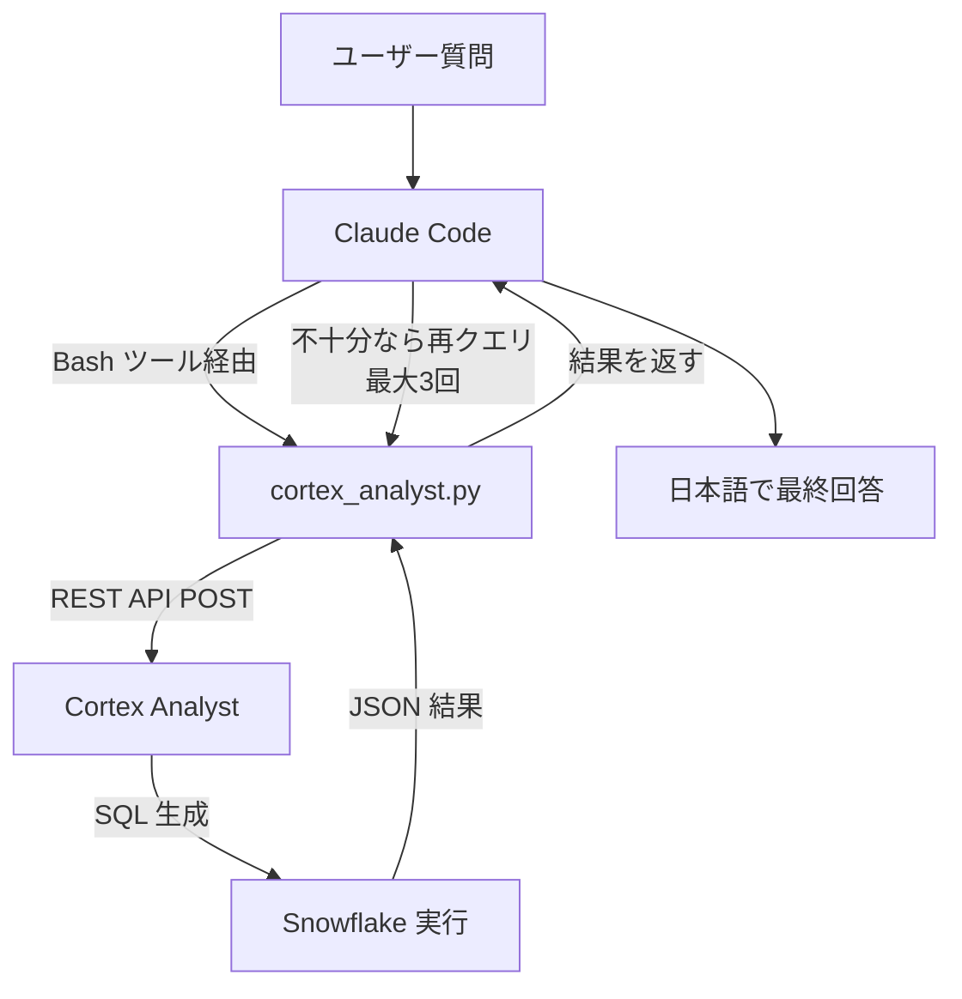

## TL;DR

- Snowflake Intelligence はリージョン制約（Claude モデル使用）で日本リージョンでは利用不可。またはクロスリージョン推論設定の有効化が必要だが社内セキュリティ基準的にNGの場合あり。
- 私用環境にて、自前のClaude からSnowflake Cortexを呼び出して擬似Snowflake Intelligenceを実現できないかやってみた。
- 本取組みは、Snowflake内のデータをClaudeに見せている点ではSnowflake Intelligence と変わらないため、**本質的な解決にはなっていません**が、Intelligence の勉強になったため投稿いたしました。


## 環境

- Snowflake（AWS ap-northeast-1 リージョン）
- Python 3.13 / snowflake-connector-python 4.3.0
- Claude Code（Sonnet 4.6）
- Semantic View

## データソース

今回使用するデータは、AWS が公開している **COVID-19 Data Lake**（S3バケットにある新型コロナ関係のデータです。(https://aws.amazon.com/jp/blogs/news/a-public-data-lake-for-analysis-of-covid-19-data/)

## 背景・課題

Snowflake Intelligence は、自然言語でデータ分析ができるエージェント AI 機能です。内部で Cortex Analyst（NL2SQL）・Cortex Search（ベクトル検索）・各種 AI 関数を組み合わせてマルチステップの回答を生成します。

しかし、**日本リージョンでは Claude モデル（オーケストレーター）が利用できないため、Snowflake Intelligence 自体が使えません。**使用するにはクロスリージョン推論設定のアカウント単位での有効化が必要になりますが、私の会社環境では執筆時点でセキュリティ的に使えない状況です。

一方で **Cortex Analyst**（NL2SQL コンポーネント）は、AWS ap-northeast-1 をネイティブサポートしており、日本リージョンでも利用可能です。

そこで「**Claude Code をオーケストレーター、Cortex Analyst を NL2SQL エンジン**として外部から組み合わせる」という構成で**擬似Intelligence** が作れるのでは？と思い作成を試みました。

## アーキテクチャ



## 事前準備：クロスリージョン推論の無効化

ACCOUNTADMIN ロールで以下を実行。

```sql
-- 現在の設定を確認
SHOW PARAMETERS LIKE 'CORTEX_ENABLED_CROSS_REGION' IN ACCOUNT;

-- 自リージョンのみに制限（ACCOUNTADMIN 必須）
ALTER ACCOUNT SET CORTEX_ENABLED_CROSS_REGION = 'DISABLED';
```


## 実装手順

### 1. 仮想環境とパッケージの準備

```bash
python3 -m venv venv
venv/bin/pip install snowflake-connector-python python-dotenv
```

### 2. Cortex Analyst CLI スクリプト抜粋（`scripts/cortex_analyst.py`）


```python
import requests
import snowflake.connector
from dotenv import load_dotenv

WAREHOUSE = "SANDBOX_WH"
ROLE = "DEVELOPER_ROLE"

def main():
    # 1. 接続を確立
    conn = snowflake.connector.connect(
        account=f"{org}-{account}",
        user=user,
        password=password,
        warehouse=WAREHOUSE,
        role=ROLE,
    )

    try:
        # 2. トークンを取得して REST API を呼び出す
        token = conn.rest.token
        url = f"https://{account_full}.snowflakecomputing.com/api/v2/cortex/analyst/message"
        headers = {"Authorization": f'Snowflake Token="{token}"', ...}
        body = {
            "messages": [{"role": "user", "content": [{"type": "text", "text": question}]}],
            "semantic_view": f"CORTEX_DB.SEMANTIC_MODELS.{model}",  # Semantic View を直接指定
        }
        resp = requests.post(url, headers=headers, json=body)

        # 3. 返ってきた SQL を同じ接続で実行
        sql = extract_sql(resp.json())
        results = execute(conn, sql)

    finally:
        conn.close()  # すべて終わってから閉じる
```

### 3. Semantic View の定義

以下の Semantic View を作成しています。

```sql
CREATE OR REPLACE SEMANTIC VIEW CORTEX_DB.SEMANTIC_MODELS.COVID19_SEMANTIC
  COMMENT = 'COVID-19分析用セマンティックビュー'

  -- 2つのマテリアライズドビューをテーブルとして登録
  TABLES (
    RAW_DB.COVID19.MV_JHU_TIMESERIES AS JHU_TIMESERIES
      PRIMARY KEY (ISO3, DATE),
    RAW_DB.COVID19.MV_COVID19_WORLD_TESTING AS WORLD_TESTING
      PRIMARY KEY (ISO_CODE, DATE)
  )

  -- ISO国コード + 日付で結合
  RELATIONSHIPS (
    JHU_TIMESERIES (ISO3, DATE)
      REFERENCES WORLD_TESTING (ISO_CODE, DATE)
  )

  -- ディメンション（グループ化・フィルタに使う列）
  DIMENSIONS (
    JHU_TIMESERIES.COUNTRY_REGION
      COMMENT '国または地域の名前'
      SYNONYMS ('country', 'nation', '国', '国名', '地域'),
    JHU_TIMESERIES.PROVINCE_STATE
      COMMENT '州・省の名前。NULLは国全体'
      SYNONYMS ('province', 'state', '州', '省'),
    JHU_TIMESERIES.DATE
      COMMENT '記録日',
    WORLD_TESTING.CONTINENT
      COMMENT '大陸名'
      SYNONYMS ('continent', '大陸', '地域区分')
  )

  -- ファクト（集計対象の数値列）
  FACTS (
    JHU_TIMESERIES.CONFIRMED
      COMMENT '累計感染確認者数'
      SYNONYMS ('cases', '感染者数', '陽性者数', '累計感染者数'),
    JHU_TIMESERIES.DEATHS
      COMMENT '累計死者数'
      SYNONYMS ('fatalities', '死者数', '死亡者数'),
    WORLD_TESTING.NEW_CASES
      COMMENT '日次新規感染者数'
      SYNONYMS ('daily cases', '新規感染者数', '日次感染者数'),
    WORLD_TESTING.PEOPLE_FULLY_VACCINATED
      COMMENT 'ワクチン接種完了者数'
      SYNONYMS ('fully vaccinated', 'ワクチン完全接種者数'),
    WORLD_TESTING.POPULATION
      COMMENT '国の総人口'
      SYNONYMS ('population', '人口', '総人口'),
    WORLD_TESTING.TOTAL_VACCINATIONS
      COMMENT 'ワクチン接種総回数'
      SYNONYMS ('ワクチン接種総数', '累計ワクチン接種数')
  )

  -- メトリクス（計算式で定義する指標）
  METRICS (
    MEASURE JHU_TIMESERIES.CASE_FATALITY_RATE AS
      CASE WHEN SUM(JHU_TIMESERIES.CONFIRMED) > 0
           THEN ROUND(SUM(JHU_TIMESERIES.DEATHS) / SUM(JHU_TIMESERIES.CONFIRMED) * 100, 2)
           ELSE NULL END
      COMMENT '致死率（%）'
      SYNONYMS ('CFR', 'fatality rate', '死亡率', '致死率'),
    MEASURE WORLD_TESTING.VACCINATION_RATE_PCT AS
      CASE WHEN SUM(WORLD_TESTING.POPULATION) > 0
           THEN ROUND(SUM(WORLD_TESTING.PEOPLE_FULLY_VACCINATED) / SUM(WORLD_TESTING.POPULATION) * 100, 1)
           ELSE NULL END
      COMMENT 'ワクチン接種率（%）'
      SYNONYMS ('vaccination rate', 'ワクチン接種率', '完全接種率')
  );
```


### 4. Claude Code カスタムコマンド（`/analyst`）

プロジェクトのスラッシュコマンド `.claude/commands/analyst.md` に以下の指示を書いておくことで、`/analyst <質問>` と打つだけで自動的に Cortex Analyst を呼び出し、結果を解釈して回答してくれます。

## 実行手順

1. Cortex Analyst を呼び出す
   ```bash
   venv/bin/python scripts/cortex_analyst.py \
     --question "<質問>" \
     --model COVID19_SEMANTIC \
     --execute
   ```
2. 結果を評価し、不十分なら追加クエリ（最大3回）
3. 最終回答を日本語で合成


### 5. `.claude/settings.local.json` でコマンド確認をスキップ

カスタムコマンド実行時に都度pythonの実行可否を聞かれるのを防ぐため、プロジェクトの許可リストに追記。

```json
{
  "permissions": {
    "allow": [
      "Bash(venv/bin/python:*)"
    ]
  }
}
```

## 動作確認

実際に `/analyst` コマンドで日本のデータを分析した例を紹介します。

### 日本の月別感染者数（累積）の推移

```
/analyst 日本の月別感染者数の推移を教えてください
```

#### 1回目：空結果

```bash
venv/bin/python scripts/cortex_analyst.py \
  --question "日本の月別感染者数の推移を教えてください" \
  --model COVID19_SEMANTIC \
  --execute
```

```json
{
  "question": "日本の月別感染者数の推移を教えてください",
  "analyst_text": "日本の月別累計感染者数の推移を、利用可能な全期間にわたって教えてください。月ごとの最大累計感染者数を月別感染者数として集計します。",
  "sql": "SELECT DATE_TRUNC('MONTH', date) AS month, MAX(confirmed) AS monthly_confirmed FROM RAW_DB.COVID19.MV_JHU_TIMESERIES WHERE country_region = 'Japan' AND province_state IS NULL GROUP BY DATE_TRUNC('MONTH', date) ORDER BY month DESC;",
  "results": [],
  "row_count": 0
}
```

Cortex Analyst は `province_state IS NULL`（国全体）に絞った SQL を生成しましたが、該当レコードが存在せず空結果になりました。

#### 2回目：英語で再質問 → 成功

Claude Code は結果が不十分と判断し、質問を英語に変えて再クエリしました。

```bash
venv/bin/python scripts/cortex_analyst.py \
  --question "Japan monthly COVID-19 confirmed cases trend" \
  --model COVID19_SEMANTIC \
  --execute
```

```json
{
  "question": "Japan monthly COVID-19 confirmed cases trend",
  "analyst_text": "Show Japan's monthly COVID-19 confirmed cases trend over the entire available time period, aggregated by month.",
  "sql": "SELECT DATE_TRUNC('MONTH', date) AS month, SUM(confirmed) AS monthly_confirmed FROM RAW_DB.COVID19.MV_JHU_TIMESERIES WHERE country_region = 'Japan' GROUP BY DATE_TRUNC('MONTH', date) ORDER BY month DESC;",
  "results": [
    { "MONTH": "2020-05-01", "MONTHLY_CONFIRMED": 462726 },
    { "MONTH": "2020-04-01", "MONTHLY_CONFIRMED": 252141 },
    { "MONTH": "2020-03-01", "MONTHLY_CONFIRMED": 28042 },
    { "MONTH": "2020-02-01", "MONTHLY_CONFIRMED": 2334 },
    { "MONTH": "2020-01-01", "MONTHLY_CONFIRMED": 56 }
  ],
  "row_count": 5
}
```

`province_state` の絞り込みなしで SQL が生成され、5件のデータが取得できました。

| 月 | 累積感染者数 | 前月比増加数 |
|---|---|---|
| 2020年1月 | 56人 | — |
| 2020年2月 | 2,334人 | +2,278人 |
| 2020年3月 | 28,042人 | +25,708人 |
| 2020年4月 | 252,141人 | +224,099人 |
| 2020年5月 | 462,726人 | +210,585人 |


## まとめ

Snowflake Intelligence が使えないリージョンでも、Cortex Analyst とClaude Code を組み合わせることで、自然言語によるデータ分析が完結する体験を作れました。
今回はAlalyst のみをルーティングさせましたが、Claude部分を工夫すれば、Cortex Search などの他のツールへのルーティングもできそうな気がします。
本取組みは、Snowflake内のデータをClaudeに見せている点ではSnowflake Intelligence と変わらないため、**Snowflake Intelligenceの日本リージョンに閉じた代替ができているとは言えません**。社内のセキュリティ基準に従ってください。
このような環境をネイティブかつセキュアに実現できる**Intelligenceは神**。早く日本に来て・・・
