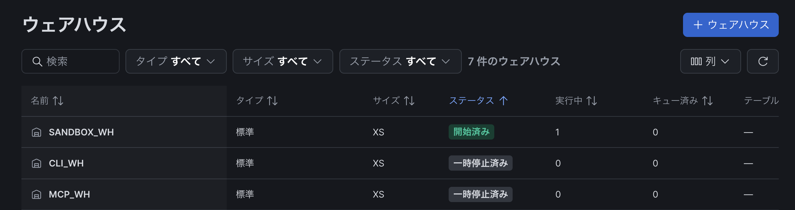
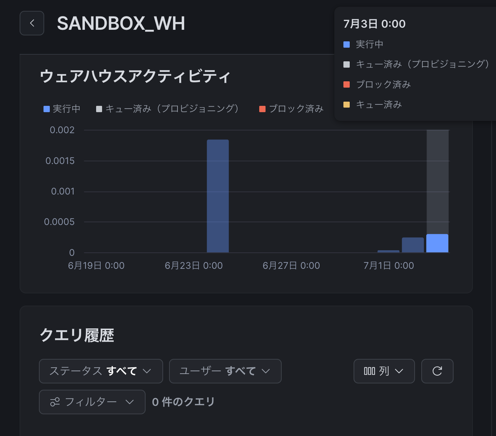
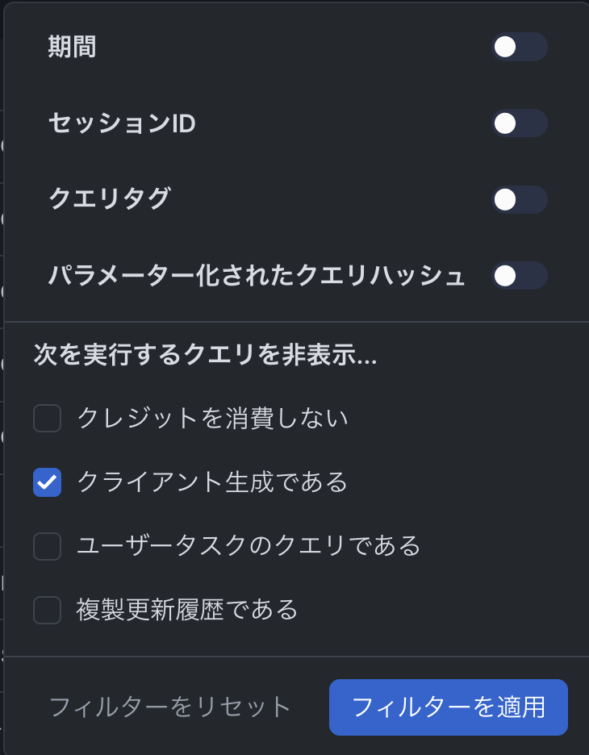
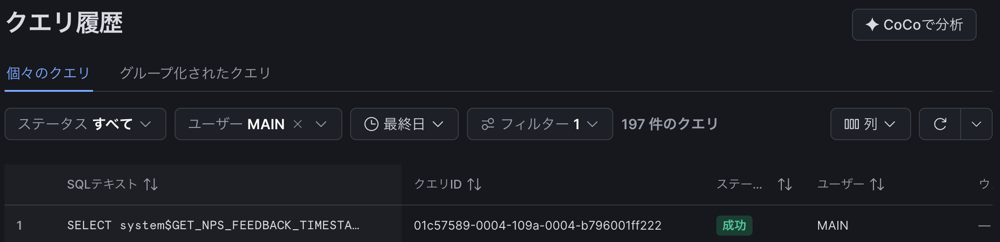

## TL;DR

- Snowsight にログインしただけでウェアハウスが起動することがある
- クエリ履歴を見てもヒットしないのは「Client-generated statements（クライアント生成ステートメント）」がデフォルトのフィルターから除外されているため
- `Monitoring » Query History` のフィルターで `Client-generated statements` を有効にすると確認できる

---

## 状況

Snowsight を開いた直後、何もクエリを打っていないのに、ウェアハウスが「実行中」になっていた。

ウェアハウスは起動した瞬間から**最低1分課金**される。使っていないのに毎回これが発生しているとすると、地味に積み上がる・・・

---

## クエリ履歴を確認してもヒットしない

原因を調べようとウェアハウスのクエリ履歴を確認したが、何も出てこない。

ウェアハウスが起動した記録はある。しかしクエリが見当たらない。

---

## 原因：Client-generated statements という仕様

原因がわからなかったのでサポートに問い合わせたところ、既知の仕様とのことだった。

Snowsight の一部のページ（Task Run History や Data Preview など）は、ページを開いた時点でデータ取得のための SQL を自動発行する。`AUTO_RESUME = TRUE` のウェアハウスが紐付いていれば、このタイミングで自動起動する。

この自動発行されるクエリが「**Client-generated statements（クライアント生成ステートメント）**」と呼ばれる分類で、デフォルトのクエリ履歴フィルターには**表示されない**設定になっている。だからクエリ履歴を見ても何もヒットしなかった。

---

## 確認方法：フィルターで表示する

`Monitoring » Query History` を開き、Filters ドロップダウンから `Client-generated statements` チェックボックスを有効にして `Apply Filters` を押す。

すると、先ほどは見えなかったクエリが出てきた。

Snowsight が裏側で発行していたクエリがここで確認できる。

---

## まとめ

| 現象 | 原因 | 確認方法 |
|---|---|---|
| ログインしただけでWHが起動 | Snowsightが一部ページでSQLを自動発行 | 仕様なので回避は難しい |
| クエリ履歴にヒットしない | Client-generated statementsはデフォルトフィルター外 | `Client-generated statements` フィルターを有効化 |

**推奨対応**：

- Snowsight 専用に X-Small のウェアハウスを用意する（本番や分析用と分離する）
- `AUTO_SUSPEND` を短めに設定する（例：60秒）と、Snowsight 起動による課金が最小限になる
