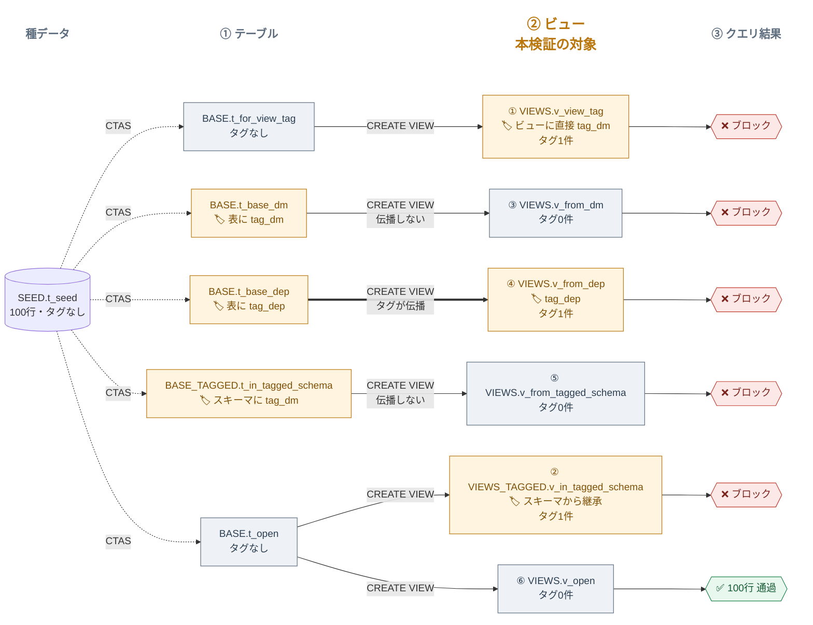

## TL;DR

- Data Movement Policy（DMP）は**基底テーブル・スキーマ・ビュー自体、どこにタグを付けてもビュー経由のクエリをブロックできる**
- 基底テーブルのタグはビューに伝播（コピー）する設定をかけられるが、**タグがビューに1件も伝播していないパターンでもブロックされる**。DMPは実行時に基底テーブルのポリシーまで見ている

## 環境

- Snowflake Enterprise Edition（トライアルアカウント）
- Data Movement Policy は **2026年8月19日にGA**。本検証はその約10日後に実施したもので、GA直後の挙動である点に留意してください
- 検証用に `DMPV_ADMIN`（タグ・ポリシー作成担当）と `DMPV_ANALYST`（制限を受ける側）の2ロールを用意

## 背景・課題

DMPは**タグ経由**でオブジェクトに適用する機能です。タグにポリシーを紐付け、そのタグをテーブルなどに付与すると、行数の閾値を超えるデータ取得（SELECT、UI表示、ダウンロード、COPY INTOなど）をブロック・アラートできます。

DMPについては非常に詳細な検証記事があるため概要はこちらを参照ください[@yuu551 さんの記事](https://dev.classmethod.jp/articles/snowflake-data-movement-policies-ga/)／[@fsegawa さんの記事](https://zenn.dev/fsegawa/articles/05e9cc2eeffe7d)

実務ではビューが中間層として多用されます。基底テーブルに直接アクセスさせず、ビュー経由でデータを提供する構成はよくあるパターンです。そこで気になったのが、**「タグをどこに付ければビューに効くのか」**という点でした。

- ビュー自体にタグを付ければ効くのか
- 基底テーブルにタグを付けただけで、ビュー経由でも効くのか
- スキーマ単位でタグを付けた場合はどうか

ただし**ビューへの適用について言及した記事は見当たらなかった**ので、そこに絞って検証しました。

## 検証設計

タグの付与位置を6パターン用意し、ビューと基底テーブルを**別スキーマ**に分けて構成しました。データは100行、閾値（`MAX_ROWS`）は50行に設定し、「全件取得は落ちる／`LIMIT 50`は通る」で判定します。

```
DMP_VIEW_DB
├── BASE            ← スキーマにはタグを付けない
│    ├── t_for_view_tag   #1 の基底テーブル（タグなし）
│    ├── t_base_dm        #3: tag_dm を表に付与
│    ├── t_base_dep       #4: tag_dep を表に付与
│    └── t_open           #2・#6 の基底テーブル（タグなし）
├── BASE_TAGGED     ← #5: このスキーマ自体に tag_dm を付与
│    └── t_in_tagged_schema
├── VIEWS           ← スキーマにはタグを付けない
│    ├── v_view_tag           #1: ビュー自体に tag_dm
│    ├── v_from_dm            #3
│    ├── v_from_dep           #4
│    ├── v_from_tagged_schema #5
│    └── v_open               #6: 対照
└── VIEWS_TAGGED    ← #2: このスキーマ自体に tag_dm を付与
     └── v_in_tagged_schema
```

ルール・ポリシーは1本ずつで、`PROPAGATE`（伝播モード）だけが違うタグを2つ用意します。

| タグ | `PROPAGATE` | 伝播する条件 |
|---|---|---|
| `tag_dm` | `ON_DATA_MOVEMENT` | データ移動（INSERT/COPY等）のみ。`CREATE VIEW`では伝播しない |
| `tag_dep` | `ON_DEPENDENCY_AND_DATA_MOVEMENT` | データ移動に加え、依存関係（`CREATE VIEW`等）でも伝播する |

`PROPAGATE`はタグ作成時に必須の指定で、省略すると`ALTER TAG ... SET DATA MOVEMENT POLICY`が失敗します。

```sql
-- ルール: Snowsight表示を50行までに制限
CREATE OR REPLACE DATA MOVEMENT RULE DMP_VIEW_DB.GOVERNANCE.rule_ui
    TYPE = 'SNOWSIGHT_UI'
    MAX_ROWS AS () RETURNS INTEGER -> (50)
    COMMENT = 'Snowsight 表示を50行までに制限';

-- ポリシー: 1つだけ。2つのタグから参照される
CREATE OR REPLACE DATA MOVEMENT POLICY DMP_VIEW_DB.GOVERNANCE.policy_view
    ENFORCE_RULES = (DMP_VIEW_DB.GOVERNANCE.rule_ui)
    COMMENT = 'ビュー適用パターン検証用（50行超でブロック）';

CREATE OR REPLACE TAG DMP_VIEW_DB.GOVERNANCE.tag_dm
    ALLOWED_VALUES 'RESTRICTED'
    PROPAGATE = ON_DATA_MOVEMENT;

CREATE OR REPLACE TAG DMP_VIEW_DB.GOVERNANCE.tag_dep
    ALLOWED_VALUES 'RESTRICTED'
    PROPAGATE = ON_DEPENDENCY_AND_DATA_MOVEMENT;

-- 同一ポリシーを複数タグに紐付けることもできる
ALTER TAG DMP_VIEW_DB.GOVERNANCE.tag_dm
    SET DATA MOVEMENT POLICY DMP_VIEW_DB.GOVERNANCE.policy_view;
ALTER TAG DMP_VIEW_DB.GOVERNANCE.tag_dep
    SET DATA MOVEMENT POLICY DMP_VIEW_DB.GOVERNANCE.policy_view;
```

### 実行順序が重要

基底テーブルにタグを付けてからビューを作らないと、`ON_DEPENDENCY_AND_DATA_MOVEMENT`によるタグ伝播を観測できません。

```sql
-- #3: 基底テーブルにタグ（ON_DATA_MOVEMENT）→ ビューには伝播しないはず
ALTER TABLE DMP_VIEW_DB.BASE.t_base_dm
    SET TAG DMP_VIEW_DB.GOVERNANCE.tag_dm = 'RESTRICTED';

-- #4: 基底テーブルにタグ（ON_DEPENDENCY_AND_DATA_MOVEMENT）→ ビューに伝播するはず
ALTER TABLE DMP_VIEW_DB.BASE.t_base_dep
    SET TAG DMP_VIEW_DB.GOVERNANCE.tag_dep = 'RESTRICTED';

-- #5: 基底テーブルの配置スキーマ全体にタグ
ALTER SCHEMA DMP_VIEW_DB.BASE_TAGGED
    SET TAG DMP_VIEW_DB.GOVERNANCE.tag_dm = 'RESTRICTED';

-- （この後にビューを作成する）
```

## 結果

**6パターン中5パターンでブロックされました。**

| # | タグの付与位置 | ビューへのタグ伝播 | 全件取得 | コメント |
|---|---|---|---|---|
| 1 | ビュー自体 | あり | ❌ ブロック | ビュー自体にタグ付けしているので当然 |
| 2 | ビュー配置スキーマ全体 | あり（スキーマから継承） | ❌ ブロック | ビューの配置スキーマにタグ付けしているので当然 |
| 3 | 基底テーブル（`ON_DATA_MOVEMENT`） | **なし（0件）** | ❌ ブロック | ビュー自体にタグはないが基底テーブルのタグが参照されている |
| 4 | 基底テーブル（`ON_DEPENDENCY_AND_DATA_MOVEMENT`） | あり | ❌ ブロック | タグが伝播（コピー）しビューにタグが自動的についている |
| 5 | 基底テーブルの配置スキーマ全体 | **なし（0件）** | ❌ ブロック | ビュー自体にタグはないが基底テーブルのタグが参照されている |
| 6 | 対照：どこにもタグなし | なし | ✅ 100行 | |

Snowsightで実際にブロックされた画面がこちらです。


### 伝播していないのにブロックされる

一番の発見は **#3と#5です**。基底テーブルに付けたタグが`ON_DATA_MOVEMENT`（データ移動のみで伝播するモード）だと、`CREATE VIEW`は「オブジェクト依存関係」の扱いになるため**ビュー側にタグは一切伝播しません**。実際に`tag_references`で確認しても0件です。

それでも、そのビューへのSELECTはブロックされました。つまりDMPは**タグの伝播状況ではなく、実行時に基底テーブル側のポリシーを評価している**ということです。マスキングポリシーが「基底テーブルの列が保護されていればビュー経由でも保護される」のと同じ考え方だと理解しています。

構成とタグ伝播の関係を図にまとめました。橙色がタグを保持しているオブジェクト、灰色はタグ0件です。③と⑤はビューが灰色（タグなし）なのに結果が赤（ブロック）になっている点に注目してください。




「ビュー自体・ビュー配置スキーマ・基底テーブル・基底テーブル配置スキーマの**どこか1箇所にタグがあればブロック**」という単純な規則です。

## ハマったポイント

### 列レベルのタグは確認できなかった（公式ドキュメントとの食い違い）

公式ドキュメントでは列タグもサポートされているとの記載ですが、実機では**一切発火しませんでした**。上で引用した記事でも言及されています。私の検証はトライアルアカウントという前提もあるため、仕様上の制約なのか一時的な不具合なのかは現時点では判断できません。実務では**テーブル単位かスキーマ単位で適用する**のが無難だと思います。


## まとめ

- DMPはビュー・基底テーブル・スキーマのどこにタグを付けても効き、**ビュー越しの回避はできない**
- セキュリティに関わる機能のため制御範囲を広めにとる思想なのだと理解しているが、反面、**ビューを重ねた場合どこまで制御が効くのか追いづらくなる**ことが想定されるので運用には注意が必要。
