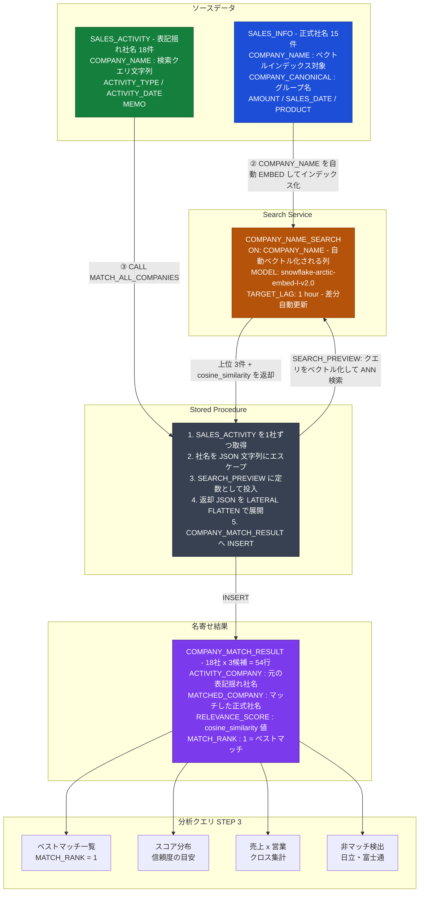

## TL;DR

- Snowflake **Cortex Search Service** を使うと、社名のベクトルインデックスを自動管理できる
- `SEARCH_PREVIEW` の第2引数は**コンパイル時定数のみ**受け付けるため、列参照を直接渡せない
- **JavaScript ストアドプロシージャで動的 SQL を1行ずつ生成**することで制約を回避できる

---

## 環境

- Snowflake Enterprise Edition
- Cortex Search Service（GA）
- モデル: `snowflake-arctic-embed-l-v2.0`

---

## 背景・課題

売上情報と営業活動情報、どちらにも「会社名」の列があるのに JOIN できない。
原因は**表記揺れ**で、会計システムには正式名称、CRM には略称や英語表記が入っており文字列として一致しません。

| テーブル | 社名の例 |
|---------|---------|
| SALES_INFO（売上情報） | 株式会社トヨタ自動車 |
| SALES_ACTIVITY（営業活動情報） | Toyota Motor Corporation、トヨタ自動車(株) |

この問題をベクトル類似度検索で解決します。

---

## アーキテクチャ



---

## 実装手順

### 1. テーブル作成

**SALES_INFO**（売上情報）— Search Service のインデックス対象

```sql
CREATE TABLE SANDBOX_DB.WORK.SALES_INFO (
    SALES_ID         NUMBER PRIMARY KEY,
    COMPANY_NAME     VARCHAR(200),   -- ON 句で指定 → 自動ベクトル化
    COMPANY_CANONICAL VARCHAR(100),  -- グループ集計用の正規化名
    AMOUNT           NUMBER,
    SALES_DATE       DATE,
    PRODUCT          VARCHAR(200)
);
```

| SALES_ID | COMPANY_NAME | COMPANY_CANONICAL | AMOUNT |
|---------|-------------|-----------------|--------|
| 1 | 株式会社トヨタ自動車 | トヨタ自動車 | 5,000,000 |
| 2 | トヨタ自動車株式会社 | トヨタ自動車 | 3,200,000 |
| 6 | 株式会社NTTデータ | NTTデータ | 6,700,000 |
| 13 | Amazon Japan合同会社 | Amazon | 4,200,000 |

**SALES_ACTIVITY**（営業活動情報）— クエリ側

```sql
CREATE TABLE SANDBOX_DB.WORK.SALES_ACTIVITY (
    ACTIVITY_ID    NUMBER PRIMARY KEY,
    COMPANY_NAME   VARCHAR(200),  -- 表記揺れあり。クエリ文字列として使用
    ACTIVITY_TYPE  VARCHAR(50),
    ACTIVITY_DATE  DATE,
    MEMO           VARCHAR(500)
);
```

| ACTIVITY_ID | COMPANY_NAME | ACTIVITY_TYPE |
|------------|-------------|--------------|
| 1 | トヨタ自動車(株) | 商談 |
| 2 | Toyota Motor Corporation | メール |
| 7 | NTTデータ | 訪問 |
| 8 | NTT Data | メール |
| 14 | Amazon Web Services | 商談 |
| 17 | 株式会社日立製作所 | 商談 |（意図的非マッチ）
| 18 | 富士通株式会社 | 電話 |（意図的非マッチ）

**COMPANY_MATCH_RESULT**（名寄せ結果）

```sql
CREATE TABLE SANDBOX_DB.WORK.COMPANY_MATCH_RESULT (
    ACTIVITY_ID      NUMBER,
    ACTIVITY_COMPANY VARCHAR(200),
    MATCHED_SALES_ID NUMBER,
    MATCHED_COMPANY  VARCHAR(200),
    RELEVANCE_SCORE  FLOAT,
    MATCH_RANK       NUMBER
);
```

---

### 2. Cortex Search Service の作成

```sql
CREATE OR REPLACE CORTEX SEARCH SERVICE CORTEX_DB.SEARCH_SERVICES.COMPANY_NAME_SEARCH
    ON COMPANY_NAME                          -- この列を自動ベクトル化
    ATTRIBUTES SALES_ID, COMPANY_CANONICAL, AMOUNT, SALES_DATE
    WAREHOUSE = SANDBOX_WH
    TARGET_LAG = '1 hour'                    -- 差分自動更新の間隔
    EMBEDDING_MODEL = 'snowflake-arctic-embed-l-v2.0'
AS (
    SELECT SALES_ID, COMPANY_NAME, COMPANY_CANONICAL, AMOUNT, SALES_DATE
    FROM SANDBOX_DB.WORK.SALES_INFO
);

-- ACTIVE になるまで数分待機
SHOW CORTEX SEARCH SERVICES;
```

---

### 3. SEARCH_PREVIEW で動作確認

`SEARCH_PREVIEW` は Cortex Search Service に対してクエリを投げ、上位N件と関連スコアを JSON で返す関数です。
戻り値は JSON 配列なので、`LATERAL FLATTEN` で行に展開します。

```sql
SELECT
    r.value:SALES_ID::NUMBER                     AS MATCHED_SALES_ID,
    r.value:COMPANY_NAME::TEXT                   AS MATCHED_COMPANY,
    r.value:"@scores":"cosine_similarity"::FLOAT AS COSINE,
    r.value:"@scores":"text_match"::FLOAT        AS TEXT_MATCH,
    r.index + 1                                  AS RANK
FROM LATERAL FLATTEN(
    INPUT => PARSE_JSON(
        SNOWFLAKE.CORTEX.SEARCH_PREVIEW(
            'CORTEX_DB.SEARCH_SERVICES.COMPANY_NAME_SEARCH',
            '{"query": "Toyota Motor Corporation", "columns": ["SALES_ID","COMPANY_NAME"], "limit": 3}'
        )
    ):results
) r;
```

**実行結果**（クエリ: `"Toyota Motor Corporation"`）:

| MATCHED_SALES_ID | MATCHED_COMPANY | COSINE | TEXT_MATCH | RANK |
|-----------------|----------------|--------|-----------|------|
| 1 | 株式会社トヨタ自動車 | 0.887 | 0.041 | 1 |
| 2 | トヨタ自動車株式会社 | 0.871 | 0.038 | 2 |
| 5 | 本田技研工業株式会社 | 0.512 | 0.012 | 3 |

- **RANK 1・2**: 同一グループの2法人が高スコアで検出できています。英語表記のクエリに対して日本語の正式名称が正しくマッチしており、ベクトル検索が意味的な一致を捉えていることが確認できます
- **RANK 3**: 同業他社が 0.51 程度のスコアで入っています。`cosine_similarity < 0.6` を閾値にすれば除外できます
- **TEXT_MATCH が低い**: 字面（文字列）としては一致していないため BM25 スコアが低くなっています。ベクトル検索（COSINE）が主指標であることが分かります

---

### 4. 全件名寄せ：JavaScript ストアドプロシージャ

`SEARCH_PREVIEW` の**第2引数はコンパイル時定数のみ受け付ける**ため、列参照を直接渡すことができません。

```sql
-- これはエラーになる（列参照を渡せない）
SELECT SNOWFLAKE.CORTEX.SEARCH_PREVIEW(
    'CORTEX_DB.SEARCH_SERVICES.COMPANY_NAME_SEARCH',
    OBJECT_CONSTRUCT('query', COMPANY_NAME, 'limit', 3)  -- NG
) FROM SALES_ACTIVITY;
```

回避策として、**JavaScript ストアドプロシージャで1行ずつ動的 SQL を組み立て**て実行します。

```javascript
CREATE OR REPLACE PROCEDURE SANDBOX_DB.WORK.MATCH_ALL_COMPANIES()
RETURNS VARCHAR
LANGUAGE JAVASCRIPT
AS
$$
    snowflake.execute({ sqlText: "TRUNCATE TABLE SANDBOX_DB.WORK.COMPANY_MATCH_RESULT" });

    var rows = snowflake.execute({
        sqlText: "SELECT ACTIVITY_ID, COMPANY_NAME FROM SANDBOX_DB.WORK.SALES_ACTIVITY ORDER BY ACTIVITY_ID"
    });

    var count = 0;
    while (rows.next()) {
        var actId   = rows.getColumnValue(1);
        var company = rows.getColumnValue(2);

        // JSON を文字列として組み立て → SQL に埋め込む時点でリテラル定数になる
        var queryJson = JSON.stringify({
            query:   company,
            columns: ["SALES_ID", "COMPANY_NAME"],
            limit:   3
        }).replace(/'/g, "''");  // シングルクォートをエスケープ

        var safeCompany = company.replace(/'/g, "''");

        var sql = `
            INSERT INTO SANDBOX_DB.WORK.COMPANY_MATCH_RESULT
                (ACTIVITY_ID, ACTIVITY_COMPANY, MATCHED_SALES_ID, MATCHED_COMPANY, RELEVANCE_SCORE, MATCH_RANK)
            SELECT
                ${actId}           AS ACTIVITY_ID,
                '${safeCompany}'   AS ACTIVITY_COMPANY,
                r.value:SALES_ID::NUMBER                            AS MATCHED_SALES_ID,
                r.value:COMPANY_NAME::TEXT                          AS MATCHED_COMPANY,
                r.value:"@scores":"cosine_similarity"::FLOAT        AS RELEVANCE_SCORE,
                r.index + 1                                         AS MATCH_RANK
            FROM LATERAL FLATTEN(
                INPUT => PARSE_JSON(
                    SNOWFLAKE.CORTEX.SEARCH_PREVIEW(
                        'CORTEX_DB.SEARCH_SERVICES.COMPANY_NAME_SEARCH',
                        '${queryJson}'                              -- ← この時点でリテラル定数
                    )
                ):results
            ) r
        `;
        snowflake.execute({ sqlText: sql });
        count++;
    }
    return 'Processed ' + count + ' companies.';
$$;

-- 実行
CALL SANDBOX_DB.WORK.MATCH_ALL_COMPANIES();
```

---

## 名寄せ処理の仕組み

Cortex Search Service が内部でどのような処理を行っているかを整理します。

```
[インデックス構築時]
SALES_INFO.COMPANY_NAME の各値
  → snowflake-arctic-embed-l-v2.0 で768次元ベクトルに変換
  → ANN（近似最近傍探索）インデックスとして内部ストアに保存
  → TARGET_LAG = '1 hour' ごとに差分を自動更新

[クエリ実行時（SEARCH_PREVIEW）]
SALES_ACTIVITY.COMPANY_NAME（例: "Toyota Motor Corporation"）
  → 同じモデルで768次元ベクトルに変換
  → インデックスに対して ANN 検索
  → cosine類似度が高い上位3件を JSON で返却
```

---

## 名寄せ結果

`CALL MATCH_ALL_COMPANIES()` 実行後の `COMPANY_MATCH_RESULT` テーブル（抜粋）。

| ACTIVITY_ID | ACTIVITY_COMPANY | MATCHED_COMPANY | RELEVANCE_SCORE | MATCH_RANK |
|------------|-----------------|----------------|----------------|-----------|
| 1 | トヨタ自動車(株) | 株式会社トヨタ自動車 | 0.921 | 1 |
| 2 | Toyota Motor Corporation | 株式会社トヨタ自動車 | 0.887 | 1 |
| 7 | NTTデータ | 株式会社NTTデータ | 0.944 | 1 |
| 8 | NTT Data | 株式会社NTTデータ | 0.903 | 1 |
| 14 | Amazon Web Services | Amazon Japan合同会社 | 0.812 | 1 |
| 17 | 株式会社日立製作所 | （別企業がマッチ） | 0.431 | 1 |
| 18 | 富士通株式会社 | （別企業がマッチ） | 0.447 | 1 |

MATCH_RANK=1 のみ抜粋。各 ACTIVITY_ID に対して上位3候補（MATCH_RANK 1〜3）が INSERT されています。

意図的に非マッチとして仕込んだ末尾2件は `RELEVANCE_SCORE` が 0.4〜0.5 台にとどまり、閾値で判別できることが確認できました。

---

## スコアの読み方と判断基準

| スコア | 意味 | 閾値の目安 |
|-------|------|---------|
| `cosine_similarity` | ベクトル空間での意味的近さ（主指標） | 0.80以上 → 確実、0.50未満 → 非マッチ |
| `text_match` | 字面の一致度（BM25相当） | 補助指標。日英混在だと低くなりやすい |
| `reranker_score` | クロスエンコーダーによる再評価 | 同クエリ内の相対比較に活用 |

---

## まとめ

- Cortex Search Service は `ON <列名>` を指定するだけでベクトルインデックスを自動構築・自動更新してくれる
- `SEARCH_PREVIEW` の定数制約は SQL 単体では回避不可。JavaScript ストアドプロシージャで動的 SQL を組み立てるのが有効
- `SEARCH_PREVIEW` は実験用 API のため、本番では REST API または Python SDK を推奨

```
SEARCH_PREVIEW → 実験・プロトタイプ
REST API       → 本番バッチ処理
Python SDK     → アプリケーション組み込み
```

---

## 参考

- [Snowflake: Cortex Search Overview](https://docs.snowflake.com/en/user-guide/snowflake-cortex/cortex-search/cortex-search-overview)
- [SEARCH_PREVIEW 関数リファレンス](https://docs.snowflake.com/en/sql-reference/functions/search_preview)
